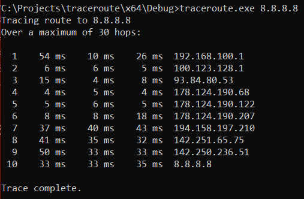
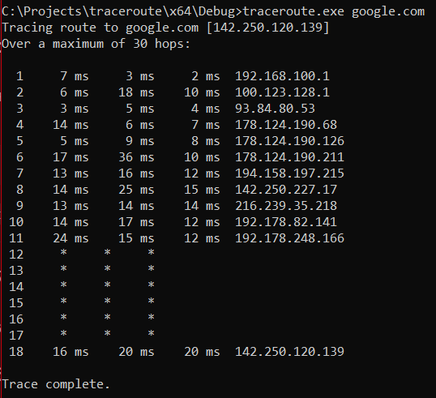
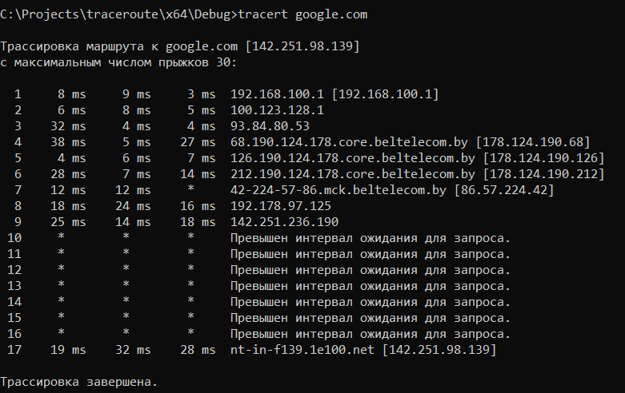
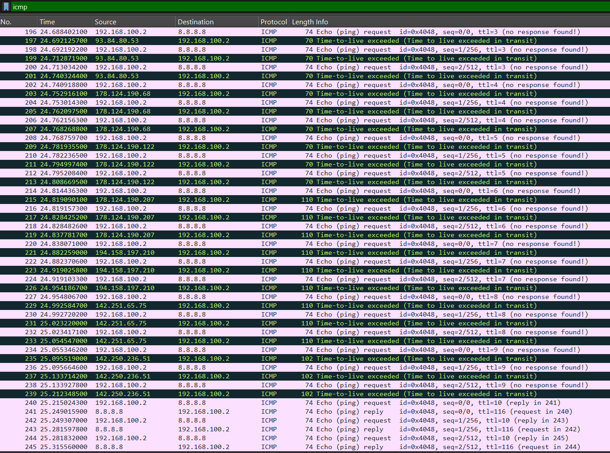
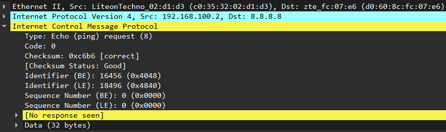
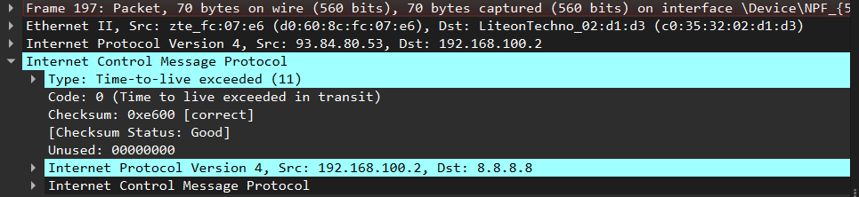
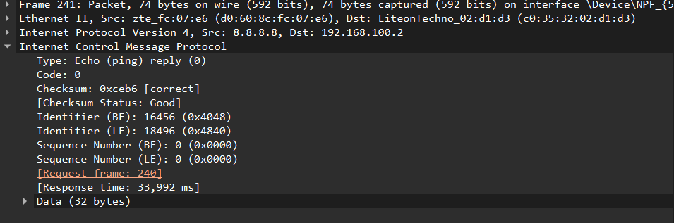

# 🌐 Traceroute на Raw Sockets (C++)

**Простой аналог утилиты traceroute/tracert**

---

## Описание

Программа для трассировки маршрута с использованием ICMP и raw sockets.

traceroute.exe 8.8.8.8

traceroute.exe google.com

traceroute.exe -d 8.8.8.8  # с обратным DNS

## Результаты работы

### 1. Запуск с IP-адресом (8.8.8.8)

### 2. Запуск с доменным именем (google.com)

### 3. Запуск стандартной tracert

[Запуск с IP](3.png)

### 4. Wireshark: общий вид трафика

### 5. Wireshark: ICMP Echo Request (Type 8)

### 6. Wireshark: ICMP Time Exceeded (Type 11)

### 7. Wireshark: ICMP Echo Reply (Type 0)

